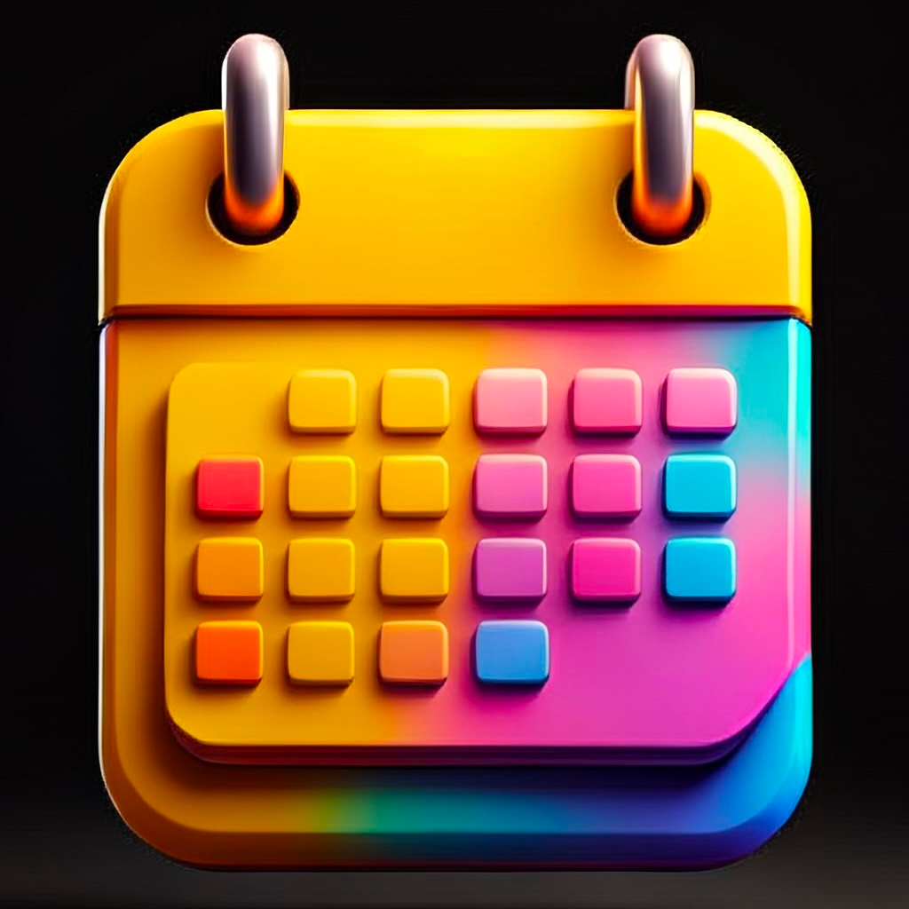
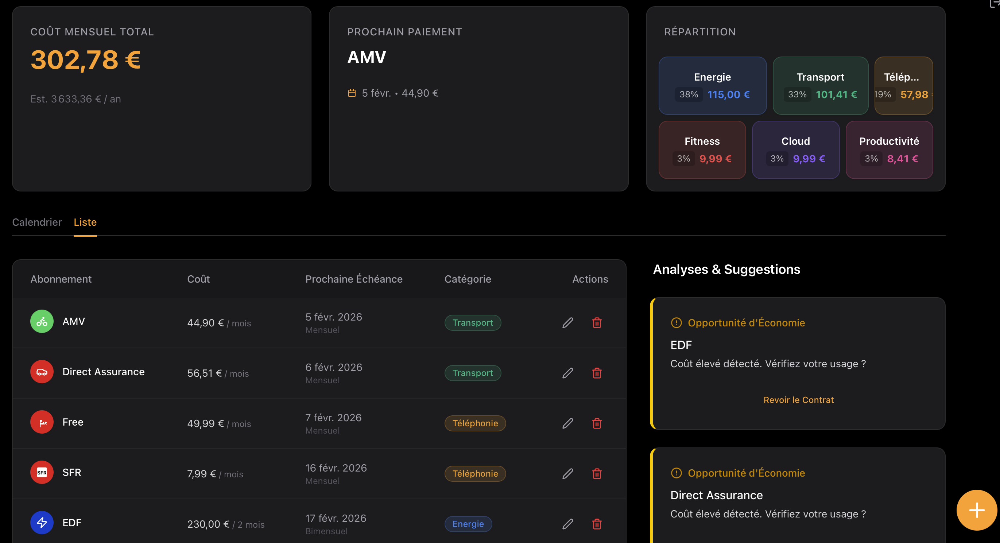
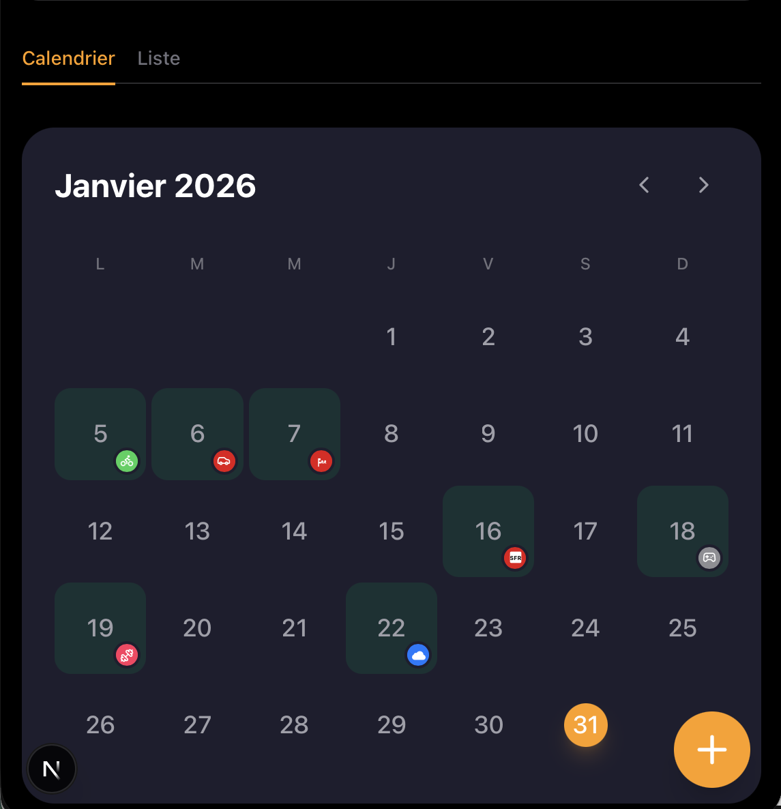
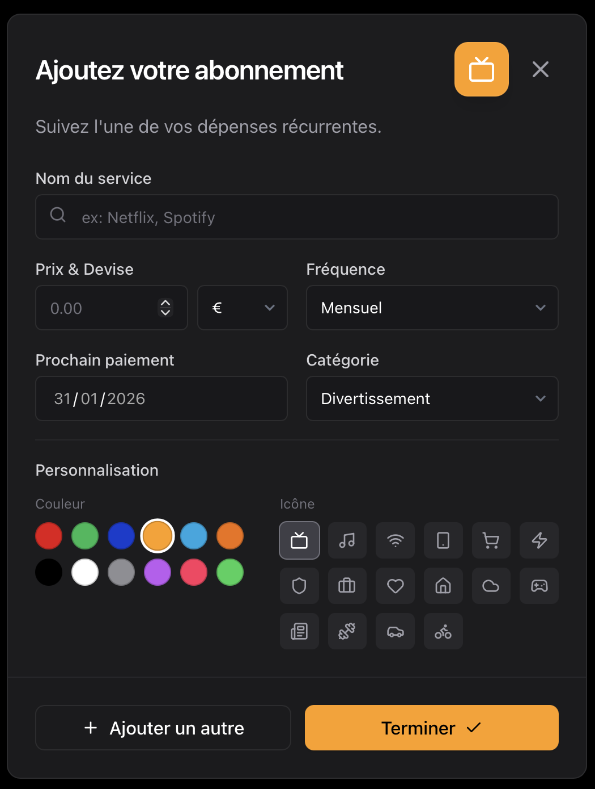

# OneSub - Gestionnaire d'Abonnements Intelligent



OneSub est une application web moderne conçue pour vous aider à reprendre le contrôle de vos finances personnelles en centralisant la gestion de tous vos abonnements.

## 🎯 Objectif

Dans une économie où le modèle par abonnement est omniprésent, il devient difficile de suivre exactement ce que l'on paie chaque mois. OneSub répond à ce problème en permettant de :

- **Centraliser** tous vos abonnements (Streaming, Logiciels, Assurances, Sport...) en un seul endroit.
- **Visualiser** l'impact financier mensuel et annuel de vos engagements.
- **Anticiper** les prélèvements à venir grâce à un **calendrier interactif**.
- **Analyser** la répartition de vos dépenses par catégories.
- **Être notifié** la veille de chaque échéance pour éviter les mauvaises surprises.

## 🛠 Stack Technique

Ce projet utilise une stack technique moderne, robuste et performante :

- **[Next.js 15](https://nextjs.org/)** (App Router) : Framework React full-stack.
- **[React 19](https://react.dev/)** : Bibliothèque UI.
- **[Typescript](https://www.typescriptlang.org/)** : Pour un code typé et maintenable.
- **[Tailwind CSS](https://tailwindcss.com/)** : Pour le styling rapide et responsive.
- **[Firebase](https://firebase.google.com/)** :
    - **Authentication** : Gestion sécurisée des utilisateurs.
    - **Firestore** : Base de données NoSQL en temps réel pour stocker les abonnements.
    - **Cloud Messaging (FCM)** : Gestion des notifications push web.
- **[Lucide React](https://lucide.dev/)** : Système d'icônes cohérent.
- **[date-fns](https://date-fns.org/)** : Manipulation avancée des dates (gestion des récurrences, calendrier).

## 📸 Galerie

### Tableau de Bord (Dashboard)
Une vue synthétique avec vos KPIs, la répartition graphique de vos dépenses et la liste de vos abonnements actifs.


### Vue Calendrier
Un calendrier intuitif pour visualiser vos échéances.
- **Vert** : Échéances passées (payées).
- **Orange** : Échéances à venir.
- **Interactivité** : Cliquez sur un jour pour voir les détails et modifier/supprimer un abonnement directement.


### Gestion des Abonnements
Une interface simple pour ajouter ou modifier vos services, avec sélection automatique des icônes et des couleurs de marque.


### Mobile First
L'interface est entièrement pensée pour mobile, avec des claviers adaptés (numérique pour les prix) et une navigation fluide.

## 🚀 Installation & Démarrage

Pour lancer ce projet localement :

1.  **Cloner le dépôt**
    ```bash
    git clone https://github.com/JeremyB006/OneSub.git
    cd OneSub
    ```

2.  **Installer les dépendances**
    ```bash
    npm install
    ```
    *Note : Assurez-vous d'avoir installé `firebase-admin` et `ts-node` pour les scripts serveurs.*

3.  **Configurer Firebase**
    Créez un fichier `.env.local` à la racine et ajoutez vos identifiants Firebase :
    ```env
    NEXT_PUBLIC_FIREBASE_API_KEY=...
    NEXT_PUBLIC_FIREBASE_AUTH_DOMAIN=...
    NEXT_PUBLIC_FIREBASE_PROJECT_ID=...
    NEXT_PUBLIC_FIREBASE_STORAGE_BUCKET=...
    NEXT_PUBLIC_FIREBASE_MESSAGING_SENDER_ID=...
    NEXT_PUBLIC_FIREBASE_APP_ID=...
    # Clé VAPID pour les notifications (Voir section Notifications)
    NEXT_PUBLIC_FIREBASE_VAPID_KEY=...
    ```

4.  **Lancer le serveur de développement**
    ```bash
    npm run dev
    ```
    L'application sera accessible sur [http://localhost:8092](http://localhost:8092).

## 🔔 Configuration des Notifications

OneSub intègre un système de notifications Web Push pour vous alerter la veille d'un paiement.

### 1. Génération de la clé VAPID
1.  Allez dans la console Firebase > Paramètres du projet > Cloud Messaging.
2.  Dans "Configuration Web", générez une nouvelle paire de clés (Certificats Push Web).
3.  Ajoutez la clé publique dans votre fichier `.env.local` :
    ```env
    NEXT_PUBLIC_FIREBASE_VAPID_KEY=votre_cle_publique
    ```

### 2. Service Worker
Le fichier `public/firebase-messaging-sw.js` gère la réception des notifications en arrière-plan.

⚠️ **Important :** Ce fichier étant servi statiquement, il ne peut pas lire les variables d'environnement (`.env.local`). Vous devez **éditer ce fichier** et remplacer les valeurs de `firebaseConfig` manuellement avec vos propres clés Firebase.

```javascript
// public/firebase-messaging-sw.js
firebase.initializeApp({
  apiKey: "VOTRE_API_KEY",
  authDomain: "VOTRE_PROJECT_ID.firebaseapp.com",
  projectId: "VOTRE_PROJECT_ID",
  // ... autres clés
});
```

### 3. Envoi Automatique des Notifications
Un script serveur est prévu pour vérifier chaque jour les abonnements arrivant à échéance le lendemain et notifier les utilisateurs concernés.

**Pré-requis :**
1.  Générez une clé privée pour votre compte de service Firebase (Console > Paramètres du projet > Comptes de service > Générer une nouvelle clé privée).
2.  Sauvegardez ce fichier JSON à la racine du projet sous le nom `service-account.json` (ce fichier est ignoré par git).

**Exécution quotidienne (CRON) :**
Utilisez le script utilitaire `scripts/run-daily-job.sh` pour lancer le processus. Idéalement, configurez une tâche CRON pour l'exécuter chaque jour (ex: à 09h00 ou 19h00).

```bash
# Rendre le script exécutable
chmod +x scripts/run-daily-job.sh

# Lancer manuellement
./scripts/run-daily-job.sh
```

Le script se chargera automatiquement de définir `GOOGLE_APPLICATION_CREDENTIALS` et d'exécuter la logique TypeScript.

## 📄 Licence

© 2026 OneSub. Tous droits réservés.
