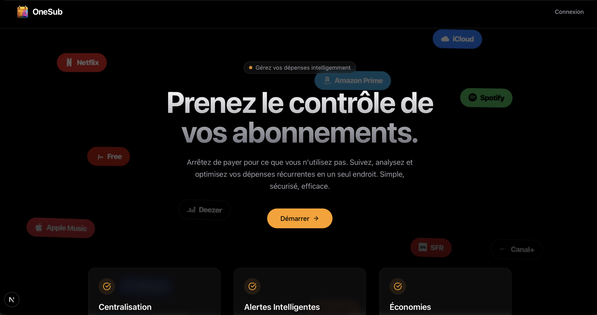

# OneSub - Gestionnaire d'Abonnements Intelligent


OneSub est une application web moderne conçue pour vous aider à reprendre le contrôle de vos finances personnelles en centralisant la gestion de tous vos abonnements.

## 🎯 Objectif

Dans une économie où le modèle par abonnement est omniprésent, il devient difficile de suivre exactement ce que l'on paie chaque mois. OneSub répond à ce problème en permettant de :

- **Centraliser** tous vos abonnements (Streaming, Logiciels, Assurances, Sport...) en un seul endroit.
- **Visualiser** l'impact financier mensuel et annuel de vos engagements.
- **Anticiper** les prélèvements à venir grâce à un **calendrier interactif**.
- **Analyser** la répartition de vos dépenses par catégories.

## 🛠 Stack Technique

Ce projet utilise une stack technique moderne, robuste et performante :

- **[Next.js 15](https://nextjs.org/)** (App Router) : Framework React full-stack.
- **[React 19](https://react.dev/)** : Bibliothèque UI.
- **[Typescript](https://www.typescriptlang.org/)** : Pour un code typé et maintenable.
- **[Tailwind CSS](https://tailwindcss.com/)** : Pour le styling rapide et responsive.
- **[Firebase](https://firebase.google.com/)** :
    - **Authentication** : Gestion sécurisée des utilisateurs.
    - **Firestore** : Base de données NoSQL en temps réel pour stocker les abonnements.
- **[Lucide React](https://lucide.dev/)** : Système d'icônes cohérent.
- **[date-fns](https://date-fns.org/)** : Manipulation avancée des dates (gestion des récurrences, calendrier).

## 📸 Galerie

### Tableau de Bord (Dashboard)
Une vue synthétique avec vos KPIs, la répartition graphique de vos dépenses et la liste de vos abonnements actifs.


### Vue Calendrier
Un calendrier intuitif pour visualiser vos échéances.
- **Vert** : Échéances passées (payées).
- **Orange** : Échéances à venir.


### Gestion des Abonnements
Une interface simple pour ajouter ou modifier vos services, avec sélection automatique des icônes et des couleurs de marque.


### Page d'Accueil
Une landing page claire et incitative.


## 🚀 Installation & Démarrage

Pour lancer ce projet localement :

1.  **Cloner le dépôt**
    ```bash
    git clone https://github.com/JeremyB006/OneSub.git
    cd OneSub
    ```

2.  **Installer les dépendances**
    ```bash
    npm install
    ```

3.  **Configurer Firebase**
    Créez un fichier `.env.local` à la racine et ajoutez vos identifiants Firebase :
    ```env
    NEXT_PUBLIC_FIREBASE_API_KEY=...
    NEXT_PUBLIC_FIREBASE_AUTH_DOMAIN=...
    NEXT_PUBLIC_FIREBASE_PROJECT_ID=...
    NEXT_PUBLIC_FIREBASE_STORAGE_BUCKET=...
    NEXT_PUBLIC_FIREBASE_MESSAGING_SENDER_ID=...
    NEXT_PUBLIC_FIREBASE_APP_ID=...
    ```

4.  **Lancer le serveur de développement**
    ```bash
    npm run dev
    ```
    L'application sera accessible sur [http://localhost:8092](http://localhost:8092).

## 📄 Licence

© 2026 OneSub. Tous droits réservés.
